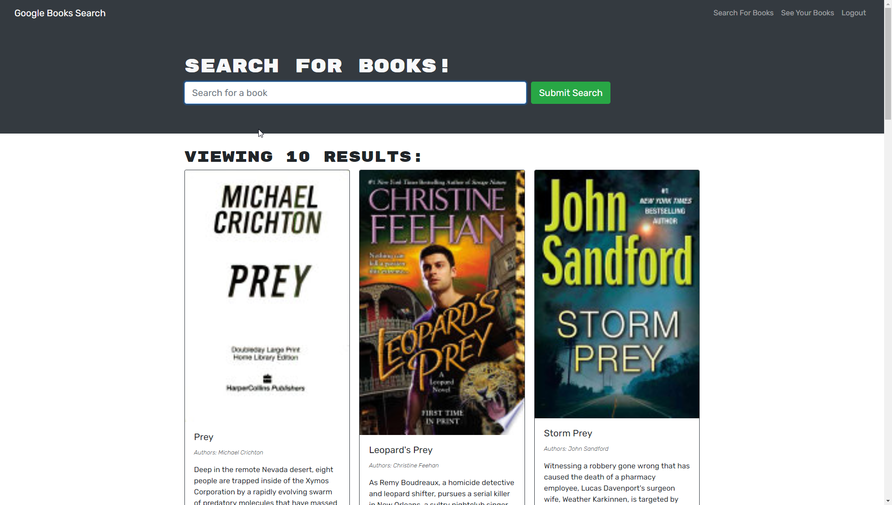
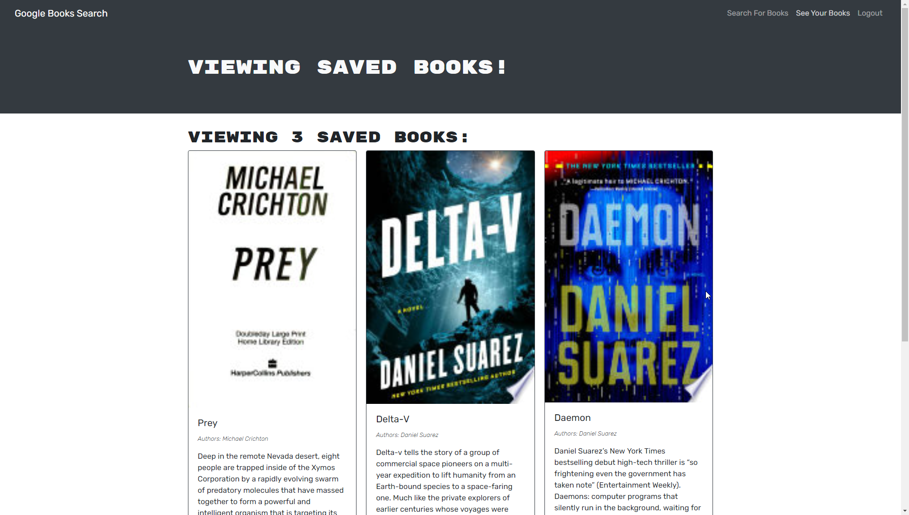

# **Book Search and Save**
 &emsp;&emsp;

&nbsp;
## **Table of Contents**
  - [**Description**](#description)
  - [**Live Application**](#live-application)
  - [**Application Screenshots and Demo**](#application-screenshots-and-demo)
  - [**Technologies and Services**](#technologies-and-services)
  - [**License**](#license)

&nbsp;
## **Description**
This book search application was provided as a functioning full stack MERN application using the [Google books API](https://developers.google.com/books/) and a custom API to save and remove books from a users profile. This app was refactored to replace the REST API implementation on the client and server with GraphQL using [Apollo Client](https://www.apollographql.com/docs/react/) and [Apollo Server](https://www.apollographql.com/docs/apollo-server/). 

The web application is hosted on Heroku for demonstration. 

&nbsp;
## **[Live Application](https://spf-book-list.herokuapp.com/)**
## **Application Screenshots and Demo**

&nbsp;
## **Technologies and Services**
Development Technologies
- Database/Models: MongoDB, Mongoose (ODM)
- Client: React, JSX, Apollo Client
- Server/APIs: Node.js, Express.js, GraphQL (Apollo Server)

External Frameworks, Services, and Credits
- [Bootstrap CSS Framework](https://getbootstrap.com/)
- Favicon [book icon](https://icons8.com/icon/42381/book) from [Icons8](https://icons8.com/)

&nbsp;
## **License**
Licensed under the [MIT](./LICENSE) license.